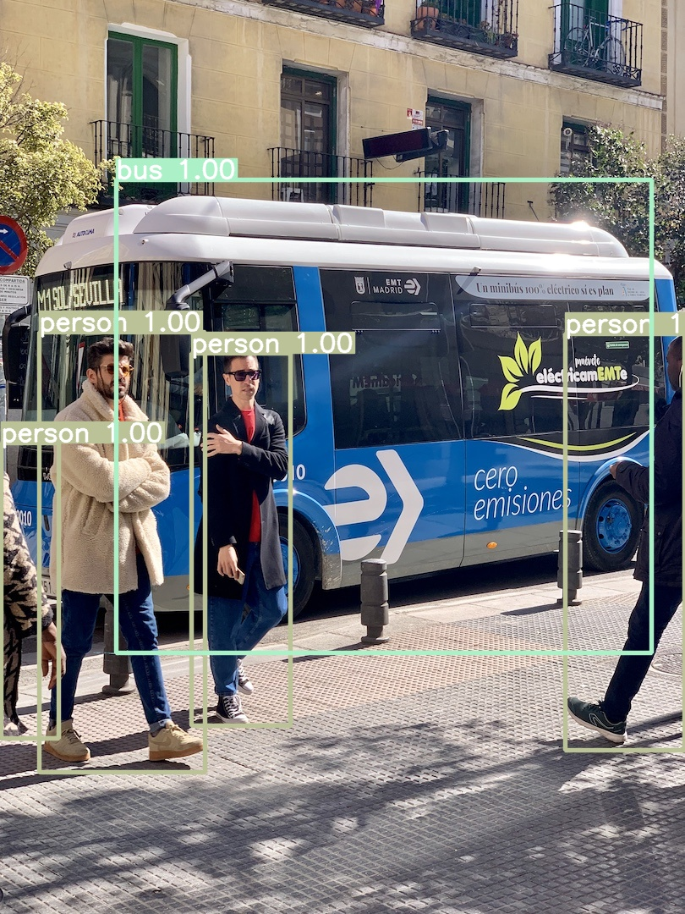

<div align="right">
  Language:
    🇺🇸
  <a title="Chinese" href="./README.zh-CN.md">🇨🇳</a>
</div>

<div align="center"><a title="" href="https://github.com/zjykzj/YOLOv4"></a></div>

<p align="center">
  «YOLOv4» reimplemented the paper "YOLOv4: Optimal Speed and Accuracy of Object Detection"
<br>
<br>
  <a href="https://github.com/RichardLitt/standard-readme"></a>
  <a href="https://conventionalcommits.org"></a>
  <a href="http://commitizen.github.io/cz-cli/"></a>
</p>

<!-- <style type="text/css">
.tg  {border-collapse:collapse;border-spacing:0;}
.tg td{border-color:black;border-style:solid;border-width:1px;font-family:Arial, sans-serif;font-size:14px;
  overflow:hidden;padding:10px 5px;word-break:normal;}
.tg th{border-color:black;border-style:solid;border-width:1px;font-family:Arial, sans-serif;font-size:14px;
  font-weight:normal;overflow:hidden;padding:10px 5px;word-break:normal;}
.tg .tg-pm1l{background-color:#FFF;color:#24292F;text-align:center;vertical-align:middle}
.tg .tg-baqh{text-align:center;vertical-align:top}
</style> -->
<table class="tg">
<thead>
  <tr>
    <th class="tg-baqh"></th>
    <th class="tg-baqh">dataset</th>
    <th class="tg-baqh">COCO AP[IoU=0.50:0.95], inference</th>
    <th class="tg-baqh">COCO AP[IoU=0.50],      inference</th>
    <th class="tg-baqh">Input Size</th>
    <th class="tg-baqh">Conf Thre</th>
    <th class="tg-baqh">NMS Thre</th>
  </tr>
</thead>
<tbody>
  <tr>
    <td class="tg-baqh"><span style="font-weight:400;font-style:normal">DarkNet (YOLOv4 paper)</span></td>
    <td class="tg-baqh">coco <span style="font-weight:400;font-style:normal">val2017</span></td>
    <td class="tg-pm1l">0.471</td>
    <td class="tg-pm1l">0.710</td>
    <td class="tg-baqh"><span style="font-weight:400;font-style:normal">416x416</span></td>
    <td class="tg-baqh">/</td>
    <td class="tg-baqh">/</td>
  </tr>
  <tr>
    <td class="tg-baqh"><span style="font-weight:400;font-style:normal">Pytorch (TianXiaomo)</span></td>
    <td class="tg-baqh">coco <span style="font-weight:400;font-style:normal">val2017</span></td>
    <td class="tg-pm1l">0.466</td>
    <td class="tg-pm1l">0.704</td>
    <td class="tg-baqh"><span style="font-weight:400;font-style:normal">416x416</span></td>
    <td class="tg-baqh">/</td>
    <td class="tg-baqh">/</td>
  </tr>
  <tr>
    <td class="tg-baqh"><span style="font-weight:400;font-style:normal">Pytorch (This)</span></td>
    <td class="tg-baqh">coco <span style="font-weight:400;font-style:normal">val2017</span></td>
    <td class="tg-baqh">0.35747</td>
    <td class="tg-baqh">0.59266</td>
    <td class="tg-baqh">608x608</td>
    <td class="tg-baqh">0.0001</td>
    <td class="tg-baqh">0.4</td>
  </tr>
</tbody>
</table>

## Table of Contents

- [Table of Contents](#table-of-contents)
- [Background](#background)
- [Installation](#installation)
- [Usage](#usage)
  - [Train](#train)
  - [Test](#test)
  - [Detect](#detect)
- [Maintainers](#maintainers)
- [Thanks](#thanks)
- [Contributing](#contributing)
- [License](#license)

## Background

The purpose of creating this warehouse is to better understand the YOLO series object detection network. Note: The
realization of the project depends heavily on the implementation
of [Tianxiaomo/pytorch-YOLOv4](https://github.com/Tianxiaomo/pytorch-YOLOv4)
and [zjykzj/YOLOv3](https://github.com/zjykzj/YOLOv3)

## Installation

Development environment (Use nvidia docker container)

```shell
docker run --gpus all -it --rm -v </path/to/YOLOv4>:/app/YOLOv4 -v </path/to/COCO>:/app/YOLOv4/COCO nvcr.io/nvidia/pytorch:22.08-py3
```

## Usage

### Train

* One GPU

```shell
CUDA_VISIBLE_DEVICES=0 python main_amp.py -c config/yolov4_default.cfg --opt-level=O0 COCO
```

* Multi GPU

```shell
CUDA_VISIBLE_DEVICES=0,1,2,3 python -m torch.distributed.launch --nproc_per_node=4 --master_port "32111" main_amp.py -c config/yolov4_Tianxiaomo.cfg --opt-level=O0 COCO
```

### Test

```shell
python val.py --cfg config/yolov4_Tianxiaomo.cfg --checkpoint outputs/yolov4_Tianxiaomo/model_best.pth.tar --conf-thre 0.0001 COCO
```

```text
 Average Precision  (AP) @[ IoU=0.50:0.95 | area=   all | maxDets=100 ] = 0.35747
 Average Precision  (AP) @[ IoU=0.50      | area=   all | maxDets=100 ] = 0.59266
 Average Precision  (AP) @[ IoU=0.75      | area=   all | maxDets=100 ] = 0.37472
 Average Precision  (AP) @[ IoU=0.50:0.95 | area= small | maxDets=100 ] = 0.20048
 Average Precision  (AP) @[ IoU=0.50:0.95 | area=medium | maxDets=100 ] = 0.41536
 Average Precision  (AP) @[ IoU=0.50:0.95 | area= large | maxDets=100 ] = 0.46257
 Average Recall     (AR) @[ IoU=0.50:0.95 | area=   all | maxDets=  1 ] = 0.29212
 Average Recall     (AR) @[ IoU=0.50:0.95 | area=   all | maxDets= 10 ] = 0.47981
 Average Recall     (AR) @[ IoU=0.50:0.95 | area=   all | maxDets=100 ] = 0.52298
 Average Recall     (AR) @[ IoU=0.50:0.95 | area= small | maxDets=100 ] = 0.40228
 Average Recall     (AR) @[ IoU=0.50:0.95 | area=medium | maxDets=100 ] = 0.58214
 Average Recall     (AR) @[ IoU=0.50:0.95 | area= large | maxDets=100 ] = 0.62584
```

### Detect

```shell
python detect.py --cfg=config/yolov4_Tianxiaomo.cfg --ckpt=outputs/yolov4_Tianxiaomo/model_best.pth.tar --source=./data/images/ --conf-thre=0.2
```

<p align="left">  </p>
  
## Maintainers

* zhujian - *Initial work* - [zjykzj](https://github.com/zjykzj)

## Thanks

* [Tianxiaomo/pytorch-YOLOv4](https://github.com/Tianxiaomo/pytorch-YOLOv4)
* [zjykzj/YOLOv3](https://github.com/zjykzj/YOLOv3)

## Contributing

Anyone's participation is welcome! Open an [issue](https://github.com/zjykzj/YOLOv4/issues) or submit PRs.

Small note:

* Git submission specifications should be complied
  with [Conventional Commits](https://www.conventionalcommits.org/en/v1.0.0-beta.4/)
* If versioned, please conform to the [Semantic Versioning 2.0.0](https://semver.org) specification
* If editing the README, please conform to the [standard-readme](https://github.com/RichardLitt/standard-readme)
  specification.

## License

[Apache License 2.0](LICENSE) © 2023 zjykzj