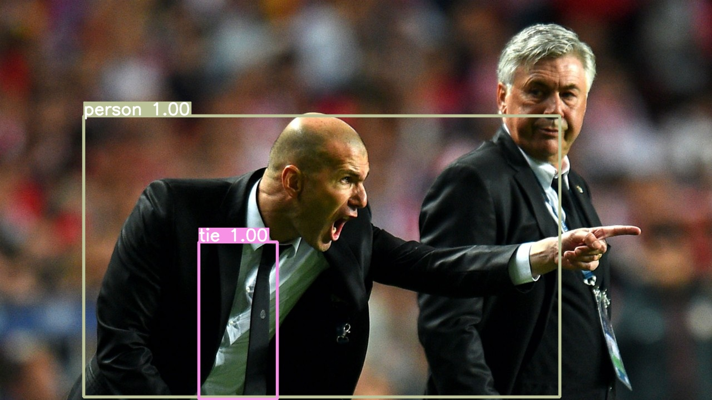

<div align="right">
  Language:
    🇺🇸
  <a title="Chinese" href="./README.zh-CN.md">🇨🇳</a>
</div>

<div align="center"><a title="" href="https://github.com/zjykzj/YOLOv4"></a></div>

<p align="center">
  «YOLOv4» reimplemented the paper "YOLOv4: Optimal Speed and Accuracy of Object Detection"
<br>
<br>
  <a href="https://github.com/RichardLitt/standard-readme"></a>
  <a href="https://conventionalcommits.org"></a>
  <a href="http://commitizen.github.io/cz-cli/"></a>
</p>

## Table of Contents

- [Table of Contents](#table-of-contents)
- [Background](#background)
- [Installation](#installation)
- [Usage](#usage)
  - [Train](#train)
  - [Test](#test)
  - [Detect](#detect)
- [Maintainers](#maintainers)
- [Thanks](#thanks)
- [Contributing](#contributing)
- [License](#license)

## Background

The purpose of creating this warehouse is to better understand the YOLO series object detection network. Note: The
realization of the project depends heavily on the implementation
of [Tianxiaomo/pytorch-YOLOv4](https://github.com/Tianxiaomo/pytorch-YOLOv4)
and [zjykzj/YOLOv3](https://github.com/zjykzj/YOLOv3)

## Installation

Development environment (Use nvidia docker container)

```shell
docker run --gpus all -it --rm -v </path/to/YOLOv4>:/app/YOLOv4 -v </path/to/COCO>:/app/YOLOv4/COCO nvcr.io/nvidia/pytorch:22.08-py3
```

## Usage

### Train

* One GPU

```shell
CUDA_VISIBLE_DEVICES=0 python main_amp.py -c config/yolov4_default.cfg --opt-level=O0 COCO
```

* Multi GPU

```shell
CUDA_VISIBLE_DEVICES=0,1,2,3 python -m torch.distributed.launch --nproc_per_node=4 --master_port "32111" main_amp.py -c config/yolov4_Tianxiaomo.cfg --opt-level=O0 COCO
```

### Test

```shell
python val.py --cfg config/yolov4_Tianxiaomo.cfg --checkpoint outputs/yolov4_Tianxiaomo_v2/model_best.pth.tar COCO
```

```text
 Average Precision  (AP) @[ IoU=0.50:0.95 | area=   all | maxDets=100 ] = 0.34612
 Average Precision  (AP) @[ IoU=0.50      | area=   all | maxDets=100 ] = 0.57824
 Average Precision  (AP) @[ IoU=0.75      | area=   all | maxDets=100 ] = 0.36227
 Average Precision  (AP) @[ IoU=0.50:0.95 | area= small | maxDets=100 ] = 0.19038
 Average Precision  (AP) @[ IoU=0.50:0.95 | area=medium | maxDets=100 ] = 0.40298
 Average Precision  (AP) @[ IoU=0.50:0.95 | area= large | maxDets=100 ] = 0.43727
 Average Recall     (AR) @[ IoU=0.50:0.95 | area=   all | maxDets=  1 ] = 0.28219
 Average Recall     (AR) @[ IoU=0.50:0.95 | area=   all | maxDets= 10 ] = 0.45297
 Average Recall     (AR) @[ IoU=0.50:0.95 | area=   all | maxDets=100 ] = 0.47952
 Average Recall     (AR) @[ IoU=0.50:0.95 | area= small | maxDets=100 ] = 0.33512
 Average Recall     (AR) @[ IoU=0.50:0.95 | area=medium | maxDets=100 ] = 0.53886
 Average Recall     (AR) @[ IoU=0.50:0.95 | area= large | maxDets=100 ] = 0.57718
```

### Detect

```shell
python detect.py --cfg=config/yolov4_Tianxiaomo.cfg --ckpt=outputs/yolov4_Tianxiaomo/model_best.pth.tar --source=./data/images/ --conf-thre=0.2
```

<p align="left">  </p>
  
## Maintainers

* zhujian - *Initial work* - [zjykzj](https://github.com/zjykzj)

## Thanks

* [Tianxiaomo/pytorch-YOLOv4](https://github.com/Tianxiaomo/pytorch-YOLOv4)
* [zjykzj/YOLOv3](https://github.com/zjykzj/YOLOv3)

## Contributing

Anyone's participation is welcome! Open an [issue](https://github.com/zjykzj/YOLOv4/issues) or submit PRs.

Small note:

* Git submission specifications should be complied
  with [Conventional Commits](https://www.conventionalcommits.org/en/v1.0.0-beta.4/)
* If versioned, please conform to the [Semantic Versioning 2.0.0](https://semver.org) specification
* If editing the README, please conform to the [standard-readme](https://github.com/RichardLitt/standard-readme)
  specification.

## License

[Apache License 2.0](LICENSE) © 2023 zjykzj